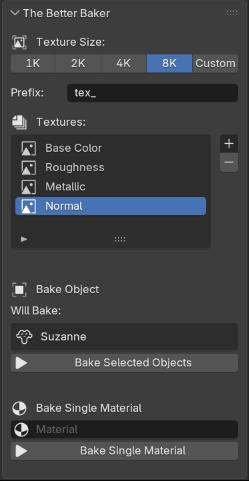

# Welcome to The Better Baker

The Better Baker is a powerfull baking tool that alows you to create quick and easy baked PBR textures for your 3D models. It is designed to be user-friendly and efficient, and most importantly, reliable simple. 

## Getting Started

Download the latest version of The Better Baker from our GitHub repository or from the downloads section. <a href="/">Download Now.</a>

### Installation

Go to edit>preferences>add-ons>{top right button}install from disk. Select the downloaded .zip file and click install. Then enable the add-on by checking the box next to it. Instalation should not take more than a few seconds.

You need not unzip the downloaded file. Not unzipping is recomended.

## Features

- Backup with a button
- Batch baking
- Customizable baking settings
- Custom texture naming
- Automatic management for multiple objects and materials
- Normals, Metalic, Colors, Roughness, Clearcoats and more.

## How To

This is how to use The Better Baker:

You can find the UI interface in the Properties panel under the render tab. The Better Baker is located just under Blenders inbuilt baking settings(which from today, you can ignore). (You will only see it if your render mode is set to Cycles.)

### Set a texture size

The Better Baker allows you to set a texture size for your baked textures. You can choose from a range of sizes, from 2K to 8K. Select custom size to set a custom texture size beyond the default options.

### Choose a file prefix

This file prefix will be used to name your baked textures. You can choose any prefix you like, and it will be added to the beginning of the texture names.

### Select textures

Choose texture types to bake. You can select from a range of texture types, including normals, metalic, colors, roughness, clearcoats and more. Simply click on the "+" button to add a new texture type, and select the desired type from the dropdown menu. To remove a texture type, click on the "-" button next to the texture type you want to remove.

If you want to bake multiple textures at once, you can add multiple texture types to the list. The Better Baker will automatically manage the baking process for all selected texture types.

### Choose a bake style

#### Bake Objects
Select the objects you want to bake(one, or many). The Better Baker will automatically manage the baking process for all selected objects. UV unwraping is necessary, because the Batter Baker uses the mesh's UV coordinates to create the baked textures for the whole object.

Use the Bake selected objects button to bake the selected objects.

#### Bake A Material
Select a material you want to bake(one, or many). The Better Baker will bake that material into a UV texture that can be later applied to any object. This is a recomeneded practice for converting procedural textures into easily sharable, distributable ones. UV unwraping will not effect the baking process, at all.

Use the Bake selected objects button to bake the selected objects.

### Press the bake button

This part just needs clicking skills. ;)

# Open the oven

Press the bake button to start the baking process. Once the baking process is complete, the baker will automaticlly create a small window on your screen for each baked texture. You can then view and save the baked textures to your desired location, or pack them into your Blender project.

The windows are Blenders inbuilt image editor, so if you have never done anything in Blender before, you might want to check out some tutorials on how to use the image editor.(You just need to know where the save button is. You'll survive.)

# Bugs

Report any bugs or issues <a href="https://github.com/thebetterbaker/thebetterbaker_addon/issues">here.</a>